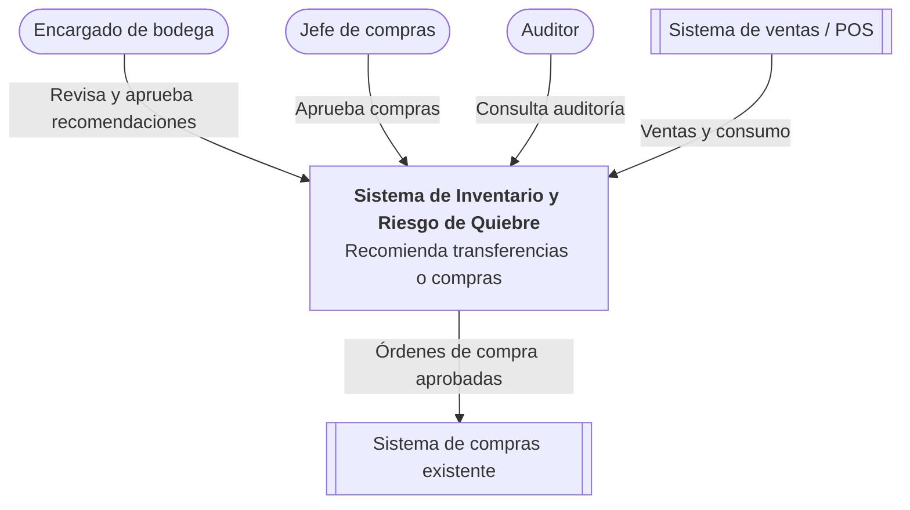
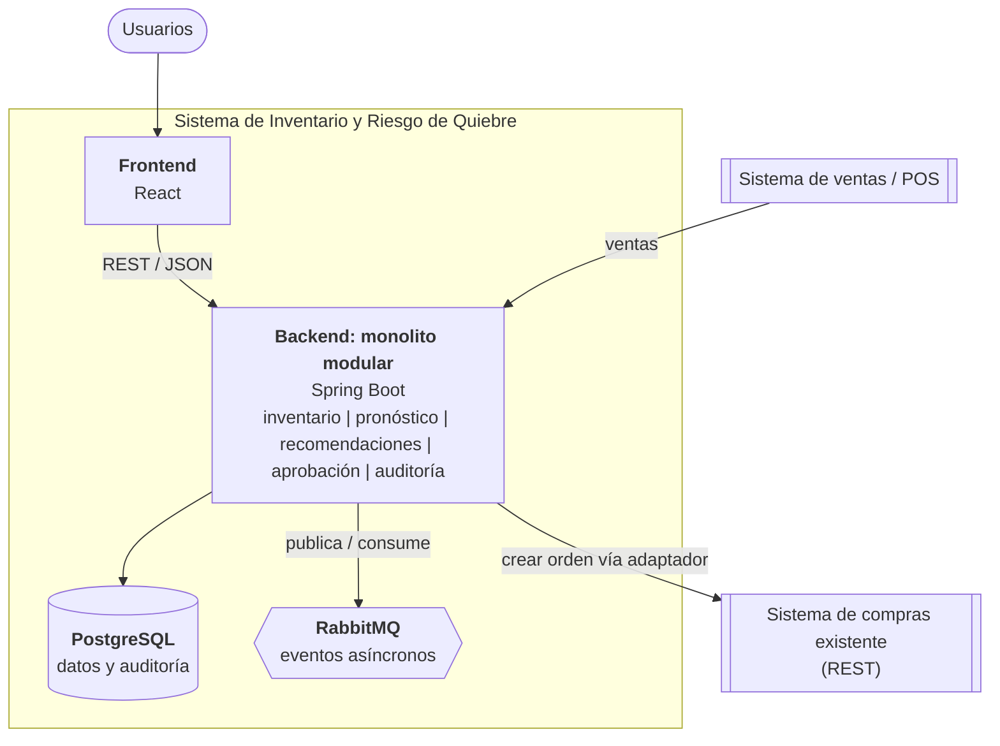
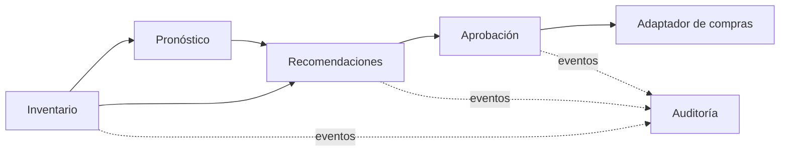

# Caso 1 — Inventario y riesgo de quiebre

Sistema que consulta existencias de varias bodegas, estima el riesgo de quiebre de stock y **recomienda** una transferencia entre bodegas o una compra. Una persona aprueba antes de ejecutar.

## 1. Objetivo, actores y alcance

**Objetivo:** evitar quiebres de stock y compras urgentes anticipando el riesgo y proponiendo una acción concreta.

**Actores**

| Actor | Rol |
|---|---|
| Encargado de bodega | Revisa alertas y aprueba o rechaza recomendaciones |
| Jefe de compras | Aprueba compras de mayor monto |
| Auditor | Consulta el historial de decisiones |
| Sistema de compras existente | Sistema externo que recibe órdenes de compra |
| Sistema de ventas / POS | Fuente de consumo histórico |

**Dentro del alcance:** consulta de existencias, estimación de riesgo, recomendación (transferencia o compra), aprobación humana, auditoría, envío de la orden aprobada al sistema de compras.

**Fuera del alcance (v1):** ejecutar compras sin aprobación, negociación con proveedores, logística de transporte, optimización multi-proveedor.

## 2. Requisitos

**Funcionales**
- RF1. Consultar existencias por producto y bodega.
- RF2. Estimar días de cobertura y riesgo de quiebre (alto / medio / bajo) por producto y bodega.
- RF3. Generar una recomendación: transferir desde una bodega con excedente, o comprar.
- RF4. Aprobar o rechazar una recomendación (con comentario).
- RF5. Al aprobar, crear la orden en el sistema de compras o registrar la transferencia.
- RF6. Registrar toda acción en una auditoría inmutable.

**Calidad**
- Disponibilidad: si el pronóstico falla, el sistema sigue operando con una regla simple (ver ADR-001 y flujo).
- Trazabilidad: toda recomendación y decisión queda con usuario, fecha y datos usados.
- Rendimiento: consulta de recomendaciones < 500 ms (p95).
- Seguridad: autenticación y roles (bodega, compras, auditor).
- Idempotencia: aprobar dos veces la misma recomendación no genera dos órdenes.
- Mantenibilidad: módulos con límites claros, listos para separarse si crece la carga.

## 3. Diagramas C4

### Nivel 1 — Contexto



### Nivel 2 — Contenedores



### Módulos internos del monolito



## 4. Flujo de una operación crítica: aprobar una recomendación

```mermaid
sequenceDiagram
    actor E as Encargado
    participant FE as Frontend
    participant API as Backend
    participant DB as PostgreSQL
    participant MQ as RabbitMQ
    participant C as Sistema de compras

    E->>FE: Aprobar recomendación
    FE->>API: POST /recomendaciones/{id}/aprobar (Idempotency-Key)
    API->>DB: Verifica estado PENDIENTE y guarda APROBADA + auditoría
    API->>MQ: Publica RecomendacionAprobada
    API-->>FE: 202 Accepted
    MQ->>API: Consumidor del adaptador de compras
    API->>C: Crear orden de compra
    alt Éxito
        C-->>API: 201 + id de orden
        API->>DB: Estado EJECUTADA + auditoría
    else Falla o timeout
        API->>MQ: Reintento con backoff
        API->>DB: Auditoría del fallo; tras N intentos queda en ERROR y alerta
    end
```

**Si el pronóstico no está disponible:** el módulo de recomendaciones aplica una regla de respaldo (promedio móvil de consumo de los últimos 14 días y stock mínimo), marca la recomendación como `origen=FALLBACK` y la muestra así al usuario. El sistema nunca se detiene por esto.

## 5. Stack propuesto y justificación

| Tecnología | Justificación |
|---|---|
| Spring Boot (Java 21) | Estándar del curso, ecosistema maduro, módulos bien separables |
| PostgreSQL | Transacciones ACID para aprobaciones y auditoría |
| React | Interfaz de revisión y aprobación |
| Docker / Docker Compose | Entorno reproducible en Codespaces |
| REST (OpenAPI) | Consulta de recomendaciones y acciones del usuario |
| RabbitMQ | Hay un proceso asíncrono real (envío a compras con reintentos) e integración con otro sistema |
| Redis | **No se incluye**: no hay una necesidad de caché demostrada |

**Decisiones del enunciado, resumidas**
- Monolito modular (ADR-001).
- Módulos: inventario, pronóstico, recomendaciones, aprobación y auditoría, más un adaptador de compras.
- Integración con compras: adaptador (anti-corruption layer) que traduce a su API REST, ejecutado de forma asíncrona.
- Las recomendaciones se **consultan por API REST**; los hechos relevantes (aprobada, ejecutada, fallida) se **publican como eventos** para auditoría e integración.

## 6. ADR

### ADR-001 (arquitectónica): Monolito modular en lugar de microservicios
- **Estado:** aceptada
- **Contexto:** equipo pequeño, un solo dominio, sin escalado independiente demostrado.
- **Decisión:** un solo backend Spring Boot con módulos de paquete aislados que se comunican por interfaces y eventos internos.
- **Consecuencias:** despliegue y depuración simples, transacciones locales. Costo: hay que cuidar los límites para poder extraer el módulo de pronóstico si crece su carga.
- **Alternativa descartada:** microservicios, por complejidad operativa sin beneficio actual.

### ADR-002 (tecnológica): RabbitMQ para el envío al sistema de compras, sin Redis
- **Estado:** aceptada
- **Contexto:** el sistema de compras puede fallar o responder lento y no debe bloquear la aprobación del usuario.
- **Decisión:** publicar `RecomendacionAprobada` en RabbitMQ y procesarla con reintentos y cola de errores (DLQ). No se agrega Redis.
- **Consecuencias:** resiliencia y desacople. Costo: un componente más y consistencia eventual (la UI muestra estado "en proceso").

## 7. Riesgos

| Riesgo | Mitigación |
|---|---|
| Pronóstico inexacto o caído | Regla de respaldo marcada como tal; medir error y revisar |
| Sistema de compras falla o duplica órdenes | Reintentos con backoff, DLQ y clave de idempotencia por recomendación |
| Datos de existencias desactualizados | Registrar fecha de última sincronización y alertar si es muy antigua |

## 8. Métricas

**Negocio:** compras urgentes por mes (objetivo: reducirlas). Complementarias: quiebres por producto, tiempo de aprobación, % de recomendaciones aceptadas.

**Técnica:** latencia p95 de `GET /recomendaciones` (< 500 ms) y tasa de errores del adaptador de compras.

---

## Cómo ejecutar

```bash
cp .env.example .env   # o usa el .env incluido
docker compose up --build
```

- API: http://localhost:8080/api/health
- RabbitMQ (gestión): http://localhost:15672
